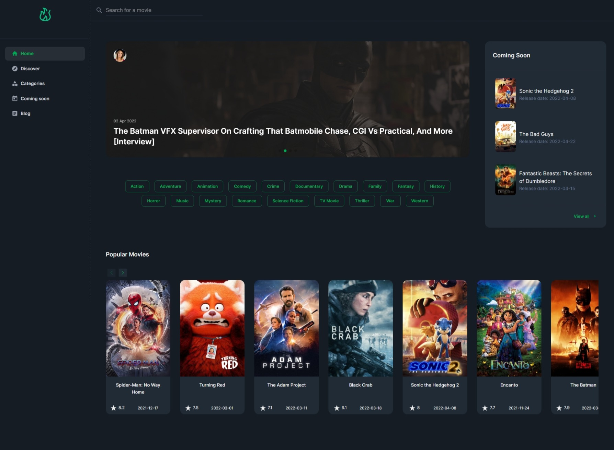

# MovieHouse
The movie database

More screenshot [>here<](public/screenshot)

## Demo
https://moviehouse.vercel.app/

## Features

- Browse movies by popularity, release date, categories or search.
- View detailed movie information like runtimes, ratings, cast/crew data, and trailer.
- Read information about videos on the blog

## Libraries and Technologies
- Accesses The Movie Database (TMDb) API for movie related data
- Uses React, Next.js
- Styled with MUI
- Uses <b>Axios</b> for data fetching
- ESLint & Prettier

## In the future
- Users auth implementation
- Add/Remove to watchlist with redux
- Moderator panel with the ability to add blog posts
- and more... ッ

## License

MIT
